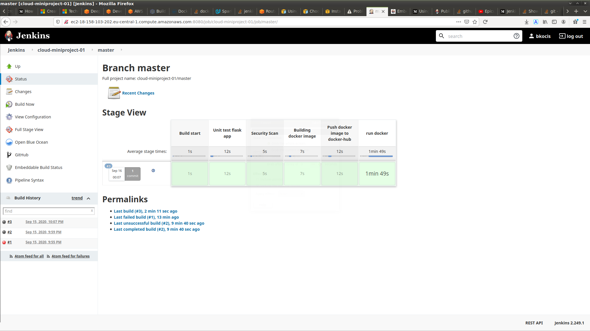
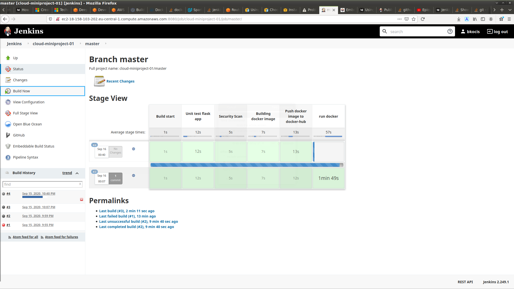
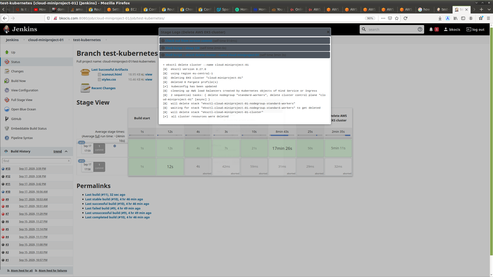

# Building and deploying flask apps using Jenkins and Kubernetes 

This repo is for exercise only and contains Jenkinsfiles for dockerizing and running flask apps in various ways. The repo has multiple branches for various scenarios and they are built separatelly in Jenskins.

Branch (`git checkout <BRANCH>`):

- __test-docker__
	The Jenkins builds the dokcer image, and runs it on the same instance. In this case the last stage is open untill the build is not stopped. The app can be available from the public address url of the instance and the defined port. 

- __test-kubernetes__
	The build in this branch defines a kubernetes cluster in one stage of the jenkins build, and in another one deploys the defined docker image. After the last stage is finished, the app that is now running in the kubernetes cluster, can be reached via the load balancer's public address (and defined port). 

## Screenshots

__1. test-docker branch build__

__2. test-docker branch app running__

__3. test-kubernetes, the app is deployed into a EKS cluster, with the last stage having a timer (with the `sleep` linux function, which shuts down the cluster after specified time__)

